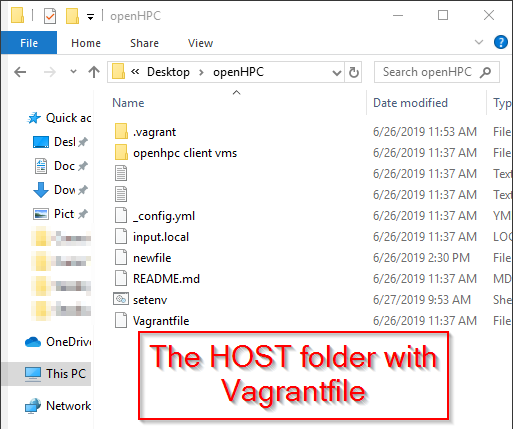

<!----- Conversion time: 1.397 seconds.


Using this Markdown file:

1. Cut and paste this output into your source file.
2. See the notes and action items below regarding this conversion run.
3. Check the rendered output (headings, lists, code blocks, tables) for proper
   formatting and use a linkchecker before you publish this page.

Conversion notes:

* Docs to Markdown version 1.0β17
* Thu Jun 27 2019 03:02:19 GMT-0700 (PDT)
* Source doc: https://docs.google.com/open?id=1Aeez_p2ebRwVGbIh5KVImHIzmNWfE_P2f5M2tK1jAIg
----->


## **(migrate to README.MD → Add-ons→ Docs to Markdown...)**


## **HOW-TO: setup OpenHPC.**


## An Introduction to OpenHPC installation & configuration for HPC Ecosystems sites

Bryan Johnston

20190627


---


## QUICKSTART

[Jump to the hands-on practical steps by clicking here.](#bookmark=id.r5m2h0l5cm7x) 

(if link does not work, scroll to “Install and prepare testbed VM through Vagrant”)


## Introduction

This document will guide you through setting up a test environment for the HPC Ecosystems OpenHPC workshop.


```
IMPORTANT! 
This workshop uses Virtualbox as a practice lab environment for the training.
Vagrant is used to manage the Virtualbox VM.
YOU DO NOT NEED VIRTUALBOX OR VAGRANT FOR THE FINAL HPC DEPLOYMENT.
Vagrant and Virtualbox are used for the TRAINING LAB.
```


This training involves deploying an **OpenHPC-ready Virtualbox VM using Vagrant**. The sections of the guide include:


1. Installing & preparing the testbed VM through Vagrant
2. Installing & preparing OpenHPC software on VM

Although this solution has not been tested on hypervisors other than Virtualbox, Vagrant deployment should allow for the same results on any hypervisor of your preference (e.g. VMware).

The VM will be pre-configured with the standard software environment used in the hands-on workshop but can also be replicated at home, in your office, in a lab, or in the bath*.

The custom modifications include:


1. tmux ; vim ; git 
2. input.local (from OpenHPC) with custom edits which do not need to be replicated
3. setenv.c

_* results may vary_


## Useful addenda & Tips


### Workload Time


*   Download speeds aside (the CentOS image is approx. 600MB), it will take approx. **10 to 15 minutes** to complete the Vagrant installation and Virtualbox VM deployment.
*   The actual time to configure the OpenHPC input.local and run through the guide will vary depending on
    *   Your willingness to read the guide thoroughly before executing each step (HIGHLY RECOMMENDED)
    *   Your familiarity with the instruction syntax and commands used
    *   Your familiarity with the HPC design being implemented here
    *   Your willingness to plan before executing (looking before you leap, crawl before you walk, read before you write, live before you die, etc.)


```
TIP: READ the instructions carefully!
Make sure you understand them before executing them - if you make a mistake, you need to know what happened so you can fix it!
```


## Install and prepare testbed VM through Vagrant


### Install Virtualbox

Virtualbox is used to run the virtual cluster. We will concentrate on deploying the Management server as a VM (but it can also be used as the final solution, but this is mostly for interest and not recommended as a long-term solution). **_This is not required for the final HPC system._**


*   [https://www.virtualbox.org/wiki/Downloads](https://www.virtualbox.org/wiki/Downloads)


### Install Vagrant environment

Vagrant is used to manage the Virtualbox VM - it will configure the VM to precise specifications for the workshop and makes sure everyone has the same setup. **_This is not required for the final HPC system._**


1. Download & install Vagrant from [https://www.vagrantup.com/downloads.html](https://www.vagrantup.com/downloads.html) 


```
TIP: There are two options for obtaining the testbed VM settings:
o Use git to clone the HPC Ecosystems OpenHPC repository (recommended)
o Directly copy the Vagrant configuration files
```


### Option 1 (RECOMMENDED): Clone git repository (YOU MUST HAVE GIT INSTALLED)

This option will keep all updates or changes synchronised with your system. This is the best long-term solution for the workshop.


1. Install git
    1. gitbash for Windows [https://gitforwindows.org/](https://gitforwindows.org/)
    2. git for Linux
    3. git for MacOS
2. (from location of git root - where you want to run the workshop files on your system; e.g. **\users\myname\desktop\openhpcworkshop\**)
3. git init
4. git remote add origin [https://github.com/brattex/hpc-ecosystems-openhpc101.git](https://github.com/brattex/hpc-ecosystems-openhpc101.git)
5. git pull origin master


### Option 2: Download the HPC Ecosystems OpenHPC SMShost Vagrantfile

This option will not use git for the workshop. This will not synchronise with the files on the OpenHPC repository. You will need to copy the files you need for the workshop to your PC. 


1. Navigate to the head / root of the directory that will host the VM for the workshop 

    (i.e. Go to the directory where you want to install the Vagrant VM and go from here, for example **/openhpc/smshost/**)

2. Download the HPC Ecosystems SMShost **Vagrantfile** into this location:

    [https://raw.githubusercontent.com/brattex/hpc-ecosystems-openhpc101/master/Vagrantfile](https://raw.githubusercontent.com/brattex/hpc-ecosystems-openhpc101/master/Vagrantfile) (note, save file as **Vagrantfile** with no file extensions)


### Deploy HPC Ecosystems OpenHPC SMShost


3. The following command (**vagrant up**) will initialise the vagrant environment (and download the vagrant VM) - the entire process may take (many) several minutes depending on the internet connection.
4. `vagrant up`
    1. This will read the Vagrantfile parameters and ...
    2. Create the Virtualbox (or other Hypervisor) framework (such as vCPUs, RAM, NIC’s, etc.) then ...
    3. Download the CentOS image and install it onto the VM. 
        1. Note: this is currently CentOS 7.5 **<span style="text-decoration:underline;">64bit</span>**
    4. Once the VM is booted up for the first time, a Vagrant shell script will run ~~a **yum update** and also~~ some **yum install** commands, all “behind-the-scenes”.
5. Once the process is completed you should be able to SSH into the VM either through (a) or (b) below.
    5. `vagrant ssh`
    6. whatever SSH client to 127.0.0.1:2229
    7. The username and password is

        **vagrant::vagrant**

6. Once you are inside your VM, the next step is to install the OpenHPC environment onto the VM...


## Install and prepare OpenHPC SMS Host


```
HINT: There are TWO configuration files
o input.local - advanced customisation of the final system (FINAL SYSTEM)
o setenv.c - simple customisation for the DEMO system
to 'source' the input.local file (i.e. to load into OS environment memory) -
source input.local

to 'source' the setenv.c file (to load into environment memory) - 
source setenv.c

AFTER THE COMMAND THE ENVIRONMENT VARIABLES (YOUR SETTINGS THAT YOU DEFINED IN THE FILE) ARE UPDATED.

```


7. Download your chosen OpenHPC image guide from:

    [https://openhpc.community/downloads/](https://openhpc.community/downloads/)


```
CentOS 7 x86_64: Install guide with xCAT (Stateless) + SLURM (PDF)

```


1. _It is a useful approach to store this PDF in the **/vagrant **shared directory_
        2. The shared directory _on the VM_ is located at **/vagrant.**
        3. The shared directory _on your host machine_ is located in the head/root of the directory structure that hosts the VM, and will be the same path as the location for the **Vagrantfile** you downloaded earlier _(e.g. /openhpc/smshost/)_

            ```
            HINT: /vagrant is not the same as /home/vagrant!!

            ```





1. Either _directly on the VM_ or _through the Vagrant shared directory_, edit the base image template **~~input.local~~ setenv.c** \

    1. The base image template is named **input.local **and is downloaded from OpenHPC Docs or from the git repository below (it is recommended to download the git repository version because this has been modified slightly for HPC Ecosystems sites). **The simplified version is setenv.c.**
    8. HINT: for simplicity, we recommend to use setenv.c for the workshop because it has a simplified list of parameters
*   download  **~~input.local~~ setenv.c** from the link below and save it in** _/vagrant_** (which is accessible in the VM): [https://github.com/brattex/hpc-ecosystems-openhpc101](https://github.com/brattex/hpc-ecosystems-openhpc101)
    9. Change appropriate parameters after the “-” symbol in the configuration file
        4. You do not need to be concerned about uncommenting what is not needed for your particular environment; this base image template is used by **recipe.sh** for automated installations and will check all the parameters before installing anything.
        5. In our case, we are doing the steps run in **recipe.sh** manually, and only the relevant global parameters for your chosen configuration will be used.
        6. HINT: You do not need to change any settings for the training workshop - but it is a good idea to change the **sms_name**.
            1. Once updated, within the VM run
            2. `. ./setenv.c`
            3. and verify your new sms_name setting by
            4. `echo $sms_name`
            5. This should display the name you set in **setenv.c**
    10. **NOTE: You must carefully plan your system design before making changes to this file - a few <span style="text-decoration:underline;">minutes</span> of planning will save you <span style="text-decoration:underline;">days</span> of debugging!**
    11. SOURCE your configuration file (setenv.c or input.local) when you are ready to load the parameters into your current shell session..
8. Follow the OpenHPC guide that you have selected from [https://openhpc.community/downloads/](https://openhpc.community/downloads/) (above)


## Install and prepare OpenHPC HPC vClients Host


9. Included in github are two virtual clients to test with the SMS host (under openhpc client vms/)
    12. OpenHPC Client 00
        7. Virtual MAC address 080027F9F3B1 (internal network ‘hpcnet’)
    13. OpenHPC Client 01
        8. Virtual MAC address 080027F59A31 (internal network ‘hpcnet’)
10. Both clients are Virtualbox VMs ready to accept a 64bit RHEL-type OS with 1GB RAM and 8GB dynamic disk. Default to PXE boot.
    14. NOTE: As of v1.3.7 the clients must have **2GB of RAM** - you can edit this within Virtualbox via **Settings → System → Base Memory**


## OpenHPC Example walkthrough

An example walkthrough is available in this Google Doc:

[https://docs.google.com/document/d/e/2PACX-1vQ3YNvqfsWkAdW-LKKaWOR4Jw-PwqEWdCojg5O_WNoReYlytS0MLaTVZqVudJg0LS3Ky2z15yG6Pjpl/pub](https://docs.google.com/document/d/e/2PACX-1vQ3YNvqfsWkAdW-LKKaWOR4Jw-PwqEWdCojg5O_WNoReYlytS0MLaTVZqVudJg0LS3Ky2z15yG6Pjpl/pub)


## Basic Overview of HPC Design Choice


*   [A basic overview of the planned layout of the OpenHPC "SMS" in relation to the WWW/WAN and HPC/LAN](https://docs.google.com/drawings/d/1dLHmKsdG1V1BkKHcwAN7WEJpGx49unMi7xDwe-L4FnQ/edit?usp=sharing)
    *   this will be useful in determining which ethX interface to use where!


## Known Issues / Bugs


*   vagrant image eth1 becomes set to “host only adapter” but should be “internal” and “hpcnet” for the DHCP to issue out on HPC network (which clients are expecting to receive DORA on).
*   no local user defined in WW guide - add a local user before booting nodes
*   [https://groups.io/g/OpenHPC-users/topic/22676845?p=,,,20,0,0,0::recentpostdate%2Fsticky,,,20,0,0,22676845](https://groups.io/g/OpenHPC-users/topic/22676845?p=,,,20,0,0,0::recentpostdate%2Fsticky,,,20,0,0,22676845)
    *   when the VM is “reset” instead of cold reboot (power off and on) it gets stuck in a stale state
    *   a workaround might be to boot from the ipxe ISO (see final post in link above)
*   VM clients have 1GB of RAM which is usable but causes some issues with the RAMdisk - increasing to 4GB is good but not necessarily practical - try 2GB and see if this improves performance.


## Other References


*   CHPC OpenHPC presentation slides
    *   [https://docs.google.com/presentation/d/1sXXEJKCml8pRlv1M1M5lHaewRON_-9LZdqFXbYmI9MY/edit?usp=sharing](https://docs.google.com/presentation/d/1sXXEJKCml8pRlv1M1M5lHaewRON_-9LZdqFXbYmI9MY/edit?usp=sharing)

<!-- Docs to Markdown version 1.0β17 -->
